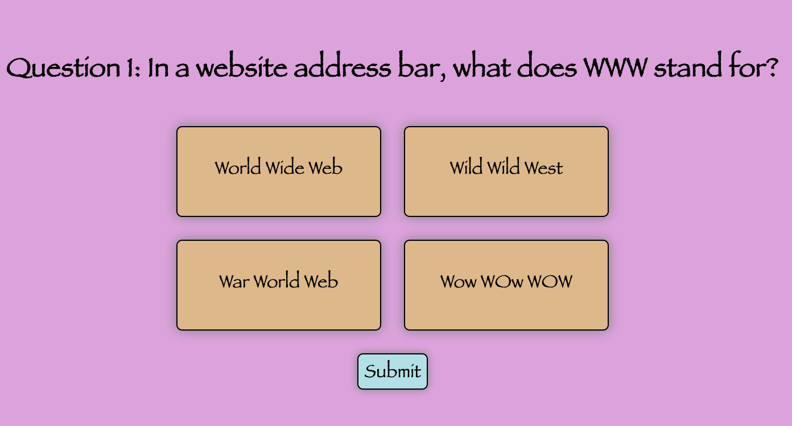
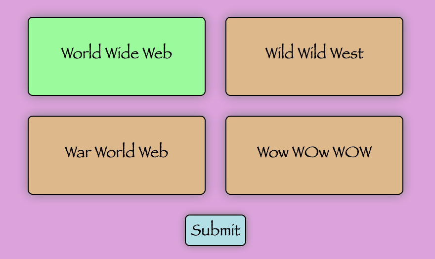
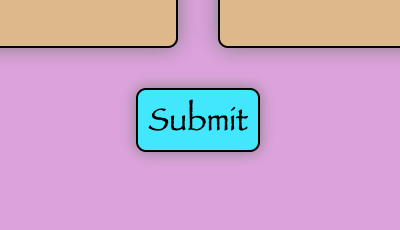
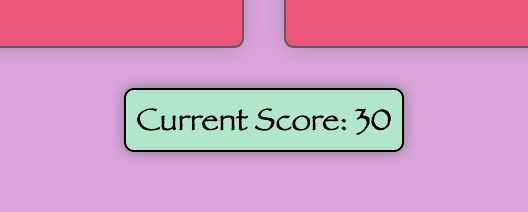

# Overview



Tandem Trivia is an online trivia game for you to play when you want to take a break from what you are doing.
You get 10 trivia questions.  See how many you can answer!

Please check it out [here](https://echen831.github.io/Tandem_Trivia/).

## Instructions

### 1) You are given 10 multiple choice questions.  Pick the answer that you feel best answers the question.



### 2) After you have selected your answer, click submit!



### 3) You will see you score at the end of each round!  Try to score as many as possible!



## Technologies Used

* React
* Javascript
* HTML/CSS
* Github/Github Pages

## Code Snippets

I wrote a shuffle function to shuffle the array of questions to ensure that questions are shuffled every round and answers are shuffled to different positions everytime.

```
export const shuffle = (arr) => {
    let dupArr = arr.slice(0);

    dupArr.forEach((num, i) => {
        let randIdx = i + Math.floor(Math.random() * arr.length - i)

        let temp = dupArr[i];
        dupArr[i] = dupArr[randIdx];
        dupArr[randIdx] = temp;
    })

    return dupArr;    
}

```
Used the React Hooks useState to manage state and useRef to change color and opacity of the answer selection after each question to show if you answered correctly.
```
const [ correctAns, setCorrectAns ] = useState(question.correct);
const [ currAns, setCurrAns ] = useState('');
const answer1 = useRef();

if (answer1.current.innerText === correctAns) {
   answer1.current.style.backgroundColor = 'green';
} else if (answer1.current.innerText === currAns && answer1.current.innerText !== correctAns) {
   answer1.current.style.opacity = 0.5;
} else {
   answer1.current.style.backgroundColor = 'red';
   answer1.current.style.opacity = 0.5;
}


```
I have an end message function that returns a different message based on your score.
```
    const endMessage = (score) => {

        if (score === 100) {
            return "You have a perfect score!"
        } else if (score >= 80) {
            return "What an amazing score!"
        } else if (score >= 60) {
            return "A couple hicups, but still an honorable score!"
        } else if (score >= 40) {
            return "Maybe try a little harder next time?"
        } else if (score >= 20) {
            return "Were you even trying?"
        } else {
            return "Please press the refresh button and try again!"
        } 
    }
```

## Please be sure to visit my portfolio and github to checkout my other projects!

[LinkedIn](https://www.linkedin.com/in/eric-chen-782b951a9/) <br>
[Github](https://github.com/echen831) <br>
[Portfolio](https://echen831.github.io/Eric-Chen/)


